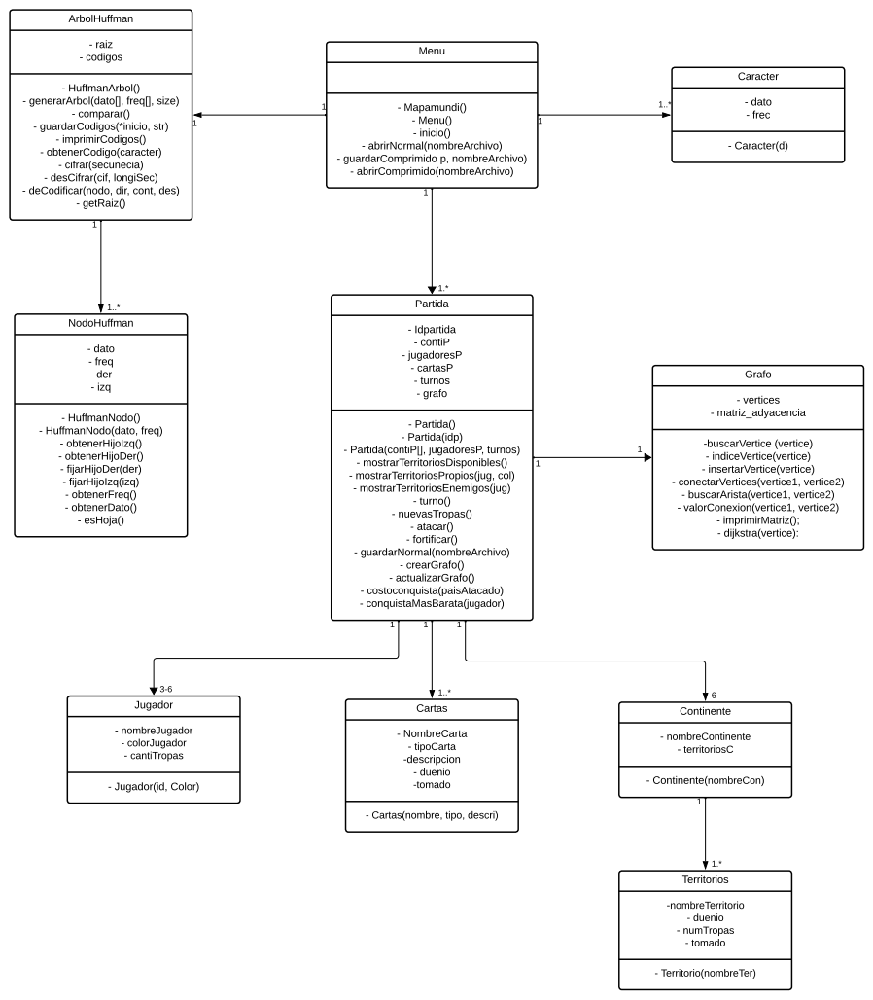

# Tads

## TAD Menu 📱
### Conjunto mínimo de datos
- partidas (Partida): Lista <Partida>, Guarda todas las partidas que se guarden en un menú
### Comportamiento del objeto
- Mapamundi(): Imprime el mapa mundi gráfico de cómo es el mapa de Risk
- Menú(): Despliega el menú con todas las funciones de Risk
- Inicio(): Inicia el juego donde cada jugador se crea y inicia sus territorios
    - Partida p = Partida(id)
- abrirNormal(string nombreArchivo): Abre el archivo .txt donde se guardó toda la información de la partida.
- guardarComprimido(Partida p, string nombreArchivo): Guarda toda la partida en un archivo .bin.
- abrirComprimido(string nombreArchivo): Abre el archivo .bin donde se guardó toda la partida.
## TAD Partida 🎯
### Conjunto mínimo de datos
- Idpartida: Entero, Identificador de la partida 
- jugadores: Lista de Jugador, Indica todos los jugadores dentro de la partida
- continentes: Arreglo de tipo Continente, Indica todos los continentes que hay dentro de la partida
- turnos: Cola de jugadores, Indica los turnos de los jugadores de la partida en orden de llegada
- cartasp: Lista de Carta: Indica todas las cartas que hay dentro de la partida
### Comportamiento del objeto
- Partida() : Operación para crear una partida sin jugadores y jugadoresTurnos 
   - Post: List<Jugador> jugadores = new List<Jugador>(0) , List<Stack> jugadoresTurnos ,List<Carta> cartas = new List< Carta >(52) , Continentes[6]
-  Partida(Int idp) : Operación para crear una partida sin jugadores y jugadoresTurnos 
   - Post: List<Jugador> jugadores = new List<Jugador>(0) , List<Stack> jugadoresTurnos ,List<Carta> cartas = new List< Carta >(52) , Continentes[6] , Idpartida = idp
- Partida(Contiente* Contipa[], List <Jugador> jugadoresP, Queue<String> turnos): Crea la partida con los datos leídos en el .txt.
  - Post: List<Jugador> jugadores =  jugadoresPa  , List<Stack> Turnos = turnosPa , Continentes[6] = ContiPa[6] 
-  mostrarTerritoriosDisponibles(): Muestra todos los territorios disponibles en la partida
-  mostrarTerritoriosPropios(string jug): Muestra todos los territorios del jugador jug
-  mostrarTerritoriosEnemigos(string jug): Muestra todos los territorios enemigos del jugador jug
-  turno() : Turno del jugador donde este puede agregar nuevas tropas , atacar o fortificar
-  nuevasTropas() : Dentro de la función turno, añade nuevas tropas según el número de territorios que tengas, dentro de un territorio en específico
-  atacar() : Dentro de la función turno, decide si quiere atacar a un territorio enemigo para conquistarlo o no.
-  fortificar(): Dentro de la funcin, Fortifica un territorio del jugador con otro del mismo jugador
- guardarNormal(string nombreArchivo)
  - Post: Return guardado
## TAD Continente 🗺️
### Conjunto mínimo de datos
- nombreContinente : String , Nombre del continente
- territoriosC: Lista de Territorio, Indica todos los territorios que estén en el continente
### Comportamiento del objeto
- Continente(String nombreCon) : Operación para crear un continente
   - Post: List<Territorio> territorios = new List<Territorio>(0) , nombreContinente = nombreCon
 
## TAD Territorio 🌐
### Conjunto mínimo de datos
- nombreTerritorio: String, Nombre del territorio
- numTropas: Entero , número de tropas en el territorio
- duenio: String , ID del deu;o de ese terrirtorio
- tomado: Booleano , Define si el territorio tiene dueño o no
### Comportamiento del objeto
- Territorio(String nombreTer): Crea un nuevo territorio
    - Post: Int numTropas = 0 , nombreTerritorio = nombreTer, tomado = false

## TAD Jugador 🤖
### Conjunto mínimo de datos
- colorJugador: String , Color del jugador dentro de la partida
- nombreJugador: String , Identificación del jugador
- cantiTropas: Entero, Número de tropas del jugador
### Comportamiento del objeto
- Jugador(String id,String color): Operación para crear un Jugador
  - Pos: nombreJugador = nombreJug, colorJugador = colorJug, cantiTropas = cantiTrop

## TAD Carta 🃏
### Conjunto mínimo de datos
- NombreCarta: String, Nombre de la carta 
- tipoCarta, String, Describe de qué tipo es la carta dentro del juego
- descripcion: String, Descripción breve de qué es la carta, también puede explicar si es una misión que tiene que hacer en la partida
- duenio: String, Define el dueño de esa carta 
- tomado: Booleano, Define si esa carta tiene o no dueño
### Comportamiento del objeto

## TAD ArbolHuffman 🏝️
### Conjunto mínimo de datos
- raiz: Puntero de tipo HuffmanNodo. Nodo raíz del árbol de Huffman.
- codigos: Vector de pares tipo caracter y string. Nodos del árbol de Huffman.
### Comportamiento del objeto
- HuffmanArbol(): Constructor del árbol de Huffman.
- generarArbol(char dato[], long freq[], int size): Se utiliza para construir el - árbol de Huffman a partir de datos de frecuencia.
- comparar: Este es el operador de comparación utilizado para la cola de prioridad.
- guardarCodigos(HuffmanNodo *inicio, string str): Genera y almacena los códigos de Huffman en el vector codigos.
imprimirCodigos(): Imprime los códigos Huffman.
- obtenerCodigo(char caracter): Devuelve el código Huffman para un carácter dado.
- cifrar(std::string secuencia): Cifra una cadena de texto utilizando los códigos Huffman.
- desCifrar(std::string cif, long longiSec): Descifra una cadena de texto utilizando los códigos de Huffman.
- deCodificar(HuffmanNodo *nodo, char dir, int &cont, std::string &des): Recibe una cadena de caracteres binarios y decodifica la secuencia mientras crea el árbol.
- getRaiz(): Obtiene el nodo raíz del árbol.

## TAD NodoHuffman ⛄
### Conjunto mínimo de datos
- dato: Tipo caracter. Dato utilizado para el árbol de Huffman.
- freq: Tipo entero. Guarda la frecuencia del dato, sirve para la construcción del árbol.
- Der: Tipo puntero de HuffmanNodo. Hijo derecho del nodo para el árbol de Huffman.
- Izq: Tipo puntero de HuffmanNodo. Hijo Izquierdo del nodo para el árbol de Huffman.
### Comportamiento del objeto
- HuffmanNodo(): Constructor vacío de nodos Huffman.
- HuffmanNodo(char dato, unsigned int freq): Constructor con dato y frecuencia para nodo Huffman.
- obtenerHijoIzq(): Obtiene los punteros al hijo izquierdo del nodo.
- obtenerHijoDer(): Obtiene los punteros al hijo derecho del nodo.
- fijarHijoDer(HuffmanNodo* der): Fija el puntero al hijo derecho del nodo.
- fijarHijoIzq(HuffmanNodo* izq): Fija el puntero al hijo izquierdo del nodo.
- obtenerFreq(): Obtiene la frecuencia asociada al nodo.
- obtenerDato(): Obtiene el carácter almacenado en el nodo.
- esHoja(): Verifica si el nodo es hoja, es decir, si no tiene hijos.

## TAD Caracter 🔠
### Conjunto mínimo de datos
- dato: Tipo caracter. Dato utilizado para el árbol de Huffman.
- frec: Tipo entero. Guarda la frecuencia del dato, sirve para la construcción del árbol.
### Comportamiento del objeto
- Caracter(char d): Constructor de Caracter.

## TAD Grafo
### Conjunto mínimo de datos
- vertices: Vector de tipo template, vector donde se encuentran todos los vertices del grafo
- matriz_adyacencia: Multi-Vector de tipo template, Multi-vector donde se guardan todas las conexiones con sus pesos
### Comportamiento del objeto
- bool buscarVertice (PaginaWeb vertice): Nos dice si esta o no el vertice en el grafo.
- int indiceVertice(PaginaWeb vertice): Nos devuelve el indice del vertice en el vector de paginas.
- bool insertarVertice(PaginaWeb vertice): Inserta un vertice en el grafo.
- bool conectarVertices(PaginaWeb vertice1 PaginaWeb vertice2): Conecta dos vertices con un peso predeterminado en la funcion.
- bool buscarArista(PaginaWeb vertice1 PaginaWeb vertice2): Nos dice si hay una arista entre dos vertices.
- U valorConexion(T vertice1, T vertice2): Devuelve el peso de la conexion partir de los dos vertices conectados 
- void imprimirMatriz();Imprijme la matrisz de adyahencia teniendo de referencia sus vertices
- vector<T> componenteVertice(T vertice): Devuelve un vector con todo el componente del vertice dado
- void prim(T vertice): Implementa el algoritmo de prim
- void dijkstra(T vertice): Implementa el algoritmo de dijkstra

# Diagrama Grafico

# Modelo Relacional

