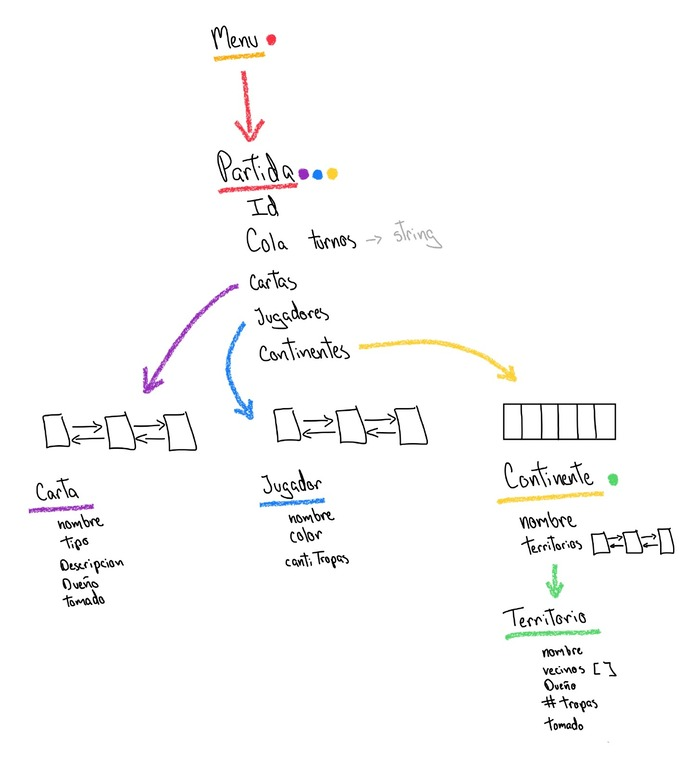

# Tads

## TAD Menu 📱
### Conjunto mínimo de datos
- partidas (Partida): Lista <Partida>, Guarda todas las partidas que se guarden en un menú
### Comportamiento del objeto
- Mapamundi(): Imprime el mapa mundi gráfico de cómo es el mapa de Risk
- Menú(): Despliega el menú con todas las funciones de Risk
- Inicio(): Inicia el juego donde cada jugador se crea y inicia sus territorios
    - Partida p = Partida(id)
- abrirNormal(string nombreArchivo): Abre el archivo de .txt donde se guardo toda la informacion de la partida
- guardarComprimido(Partida p,string nombreArchivo) : Guarda toda la partida en en un .bin
- abrirComprimido(string nombreArchivo): Abre el .bin donde se guardo toda la partida
## TAD Partida 🎯
### Conjunto mínimo de datos
- Idpartida: Entero, Identificador de la partida 
- jugadores: Lista de Jugador, Indica todos los jugadores dentro de la partida
- continentes: Arreglo de tipo Continente, Indica todos los continentes que hay dentro de la partida
- turnos: Cola de jugadores, Indica los turnos de los jugadores de la partida en orden de llegada
- cartasp: Lista de Carta: Indica todas las cartas que hay dentro de la partida
### Comportamiento del objeto
- Partida() : Operación para crear una partida sin jugadores y jugadoresTurnos 
   - Post: List<Jugador> jugadores = new List<Jugador>(0) , List<Stack> jugadoresTurnos ,List<Carta> cartas = new List< Carta >(52) , Continentes[6]
-  Partida(Int idp) : Operación para crear una partida sin jugadores y jugadoresTurnos 
   - Post: List<Jugador> jugadores = new List<Jugador>(0) , List<Stack> jugadoresTurnos ,List<Carta> cartas = new List< Carta >(52) , Continentes[6] , Idpartida = idp
- Partida(Contiente* Contipa[] , List <Jugador> jugadoresP ,  Queue<String> turnos)
  - Post: List<Jugador> jugadores =  jugadoresPa  , List<Stack> Turnos = turnosPa , Continentes[6] = ContiPa[6] 
-  mostrarTerritoriosDisponibles(): Muestra todos los territorios disponibles en la partida
-  mostrarTerritoriosPropios(string jug): Muestra todos los territorios del jugador jug
-  mostrarTerritoriosEnemigos(string jug): Muestra todos los territorios enemigos del jugador jug
-  turno() : Turno del jugador donde este puede agregar nuevas tropas , atacar o fortificar
-  nuevasTropas() : Dentro de la función turno, añade nuevas tropas según el número de territorios que tengas, dentro de un territorio en específico
-  atacar() : Dentro de la función turno, decide si quiere atacar a un territorio enemigo para conquistarlo o no.
-  fortificar(): Dentro de la funcin, Fortifica un territorio del jugador con otro del mismo jugador
- guardarNormal(string nombreArchivo)
  - Post: Return guardado
## TAD Continente 🗺️
### Conjunto mínimo de datos
- nombreContinente : String , Nombre del continente
- territoriosC: Lista de Territorio, Indica todos los territorios que estén en el continente
### Comportamiento del objeto
- Continente(String nombreCon) : Operación para crear un continente
   - Post: List<Territorio> territorios = new List<Territorio>(0) , nombreContinente = nombreCon
 
## TAD Territorio 🌐
### Conjunto mínimo de datos
- nombreTerritorio: String, Nombre del territorio
- numTropas: Entero , número de tropas en el territorio
- duenio: String , ID del deu;o de ese terrirtorio
- tomado: Booleano , Define si el territorio tiene dueño o no
### Comportamiento del objeto
- Territorio(String nombreTer): Crea un nuevo territorio
    - Post: Int numTropas = 0 , nombreTerritorio = nombreTer, tomado = false

## TAD Jugador 🤖
### Conjunto mínimo de datos
- colorJugador: String , Color del jugador dentro de la partida
- nombreJugador: String , Identificación del jugador
- cantiTropas: Entero, Número de tropas del jugador
### Comportamiento del objeto
- Jugador(String id,String color): Operación para crear un Jugador
  - Pos: nombreJugador = nombreJug, colorJugador = colorJug, cantiTropas = cantiTrop

## TAD Carta 🃏
### Conjunto mínimo de datos
- NombreCarta: String, Nombre de la carta 
- tipoCarta, String, Describe de qué tipo es la carta dentro del juego
- descripcion: String, Descripción breve de qué es la carta, también puede explicar si es una misión que tiene que hacer en la partida
- duenio: String, Define el dueño de esa carta 
- tomado: Booleano, Define si esa carta tiene o no dueño
### Comportamiento del objeto

## TAD ArbolHuffman
### Conjunto mínimo de datos
- raiz: Puntero de tipo HuffmanNodo, nodo raiz del arbol de Huffmann
- codigos ,Vector de pares tipo caracter y string: Nodos del arbol de Huffman.
### Comportamiento del objeto
- HuffmanArbol() Constructor del arbol de Huffman
- generarArbol(char dato[], long freq[],int size) : se utiliza para construir el arbol de Huffman a partir de datos de frecuencia
- comparar
- guardarCodigos(HuffmanNodo *inicio, string str):
- imprimirCodigos(): Imprime los codigos huffman:
- obtenerCodigo(char caracter): Devuelve el codigo huffman para un caracter dado
- cifrar(std::string secunecia) : cirfra una cadena de texto utilizando los codigos Huffman
- desCifrar(std::string cif, long longiSec): decifra una cadena de texto utilizando los codigos de Huffman
- deCodificar(HuffmanNodo *nodo, char dir, int &cont, std::string &des): recive una cadena de caracteres binarios y decodifica la secuancia y va creando el arbol
-  getRaiz() : Obtener el nodo raiz del arbol

## TAD NodoHuffman
### Conjunto mínimo de datos
- dato
- freq
- Der, Tipo puntero de HuffmanNodo, Hijo derecho del nodo para el arbol de Huffman
- Izq,  Tipo puntero de HuffmanNodo, Hijo Izquierdo del nodo para el arbol de Huffman
### Comportamiento del objeto
-  HuffmanNodo() : Constructor vacio de nodosHuffman
-  HuffmanNodo(char dato, unsigned int freq): constructor de con dato y frecuencia para nodoHuffman
-  obtenerHijoIzq(): obtener los punteros al hijo izquierdo del nodo
-  obtenerHijoDer(): obtener los punteros al hijo derecho del nodo
-  fijarHijoDer(HuffmanNodo* der): Fija el puntero al hijo Izquierdo del nodo
-  fijarHijoIzq(HuffmanNodo* izq): Fija el puntero al hijo Izquierdo del nodo
-  obtenerFreq(): Obtener la frecuencia asociada al nodo
-  obtenerDato(): Obtener el caracter almacenado en el nodo
-  esHoja(): Verifica si el nodo es hoja osea si no tiene hijos

## TAD Caracter
### Conjunto mínimo de datos
- dato, Tipo caracter, dato utilizadp para el arbol de huffman
- frec, Tipo entero ,  Guarda la frecuencia del dato, sirve para la construcion del arbol
### Comportamiento del objeto
- Caracter(char d): Constructor de Caracter

# Diagrama Grafico

# Modelo Relacional

