# ⚠️ Plan de pruebas ⚠️

## Menu 📱

### 1. Ingresar comando "inicializar" 🛫
Entrada: inicializar

Resultado Esperado: se crea el objeto de tipo partida y se llama su constructor.

Resultado Obtenido: ✅

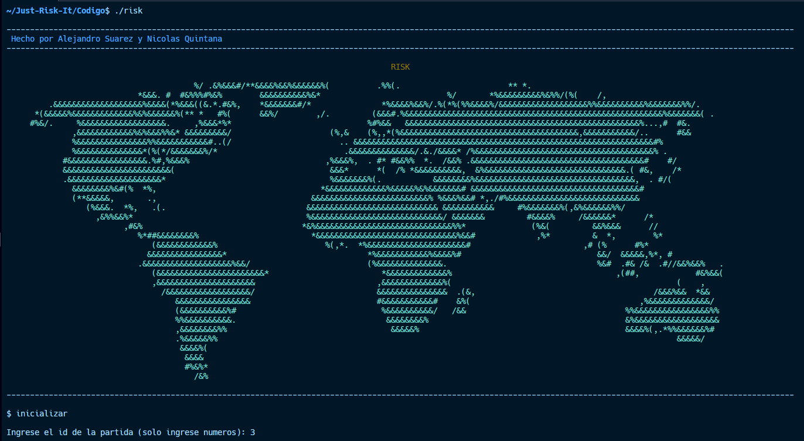

### 2. Ingresar comando "turno <id_jugador>" 🎏
Entrada: turno <id_jugador>

Resultado Esperado: la partida no ha iniciado, no se encuentra el jugador, no es el turno del jugador o se llama a la funcion turno() del objeto partida mencionado anteriormente.

Resultado Obtenido: ✅, ✅, ✅, ✅

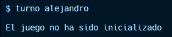

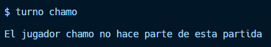

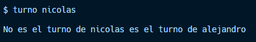

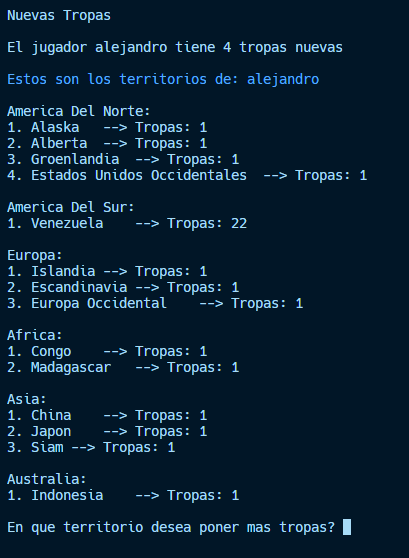

### 3. Ingresar comando "ayuda" 🆘
Entrada: ayuda

Resultado Esperado: muestra lista de posibles comandos y una breve explicación.

Resultado Obtenido: ✅

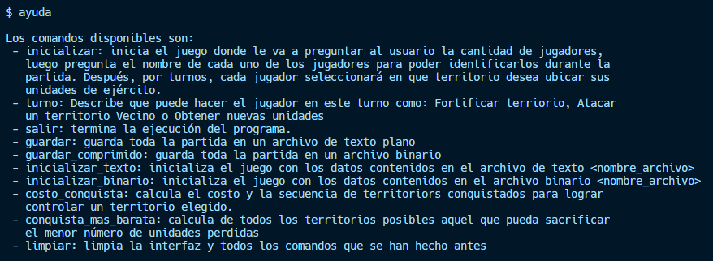

### 4. Ingresar comando "limpiar" 🧹
Entrada: limpiar

Resultado Esperado: limpia la terminal y solo queda el banner.

Resultado Obtenido: ✅

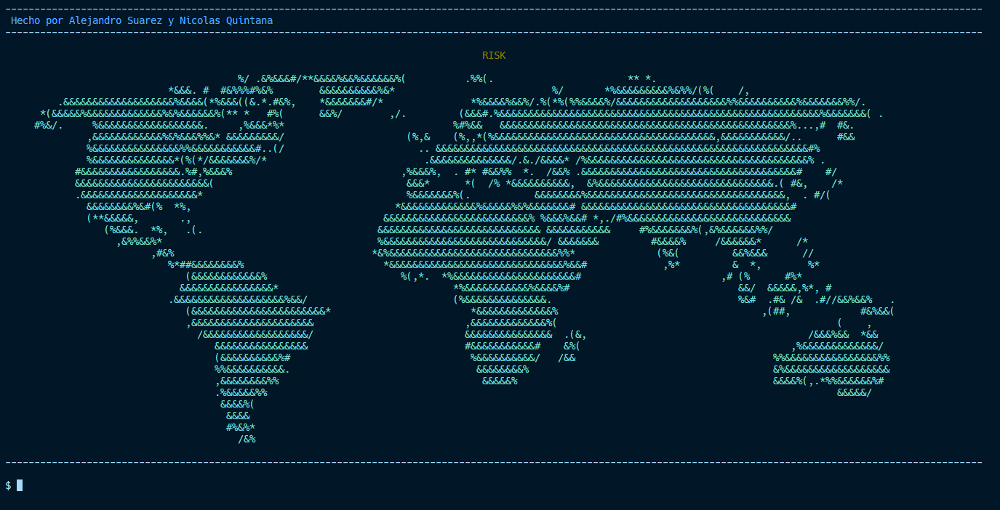

## Constructor Partida 🎮

### 1. Ingresar numero de jugadores 😶‍🌫️
Entrada: un numero entero entre 3 y 6

Resultado Esperado: si el numero cumple la condición sigue con el siguiente paso.

Resultado Obtenido: ✅

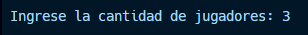

### 2. Ingresar nombre de los jugadores 🪪
Entrada: nombre del jugador 

Resultado Esperado: muestra el nombre del jugador y el color que le tocó.

Resultado Obtenido: ✅

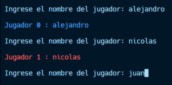

### 3. Elegir territorios por turnos 📍
Entrada: nombre del territorio 

Resultado Esperado: muestra el nombre del territorio y el jugador que lo eligió.

Resultado Obtenido: ✅

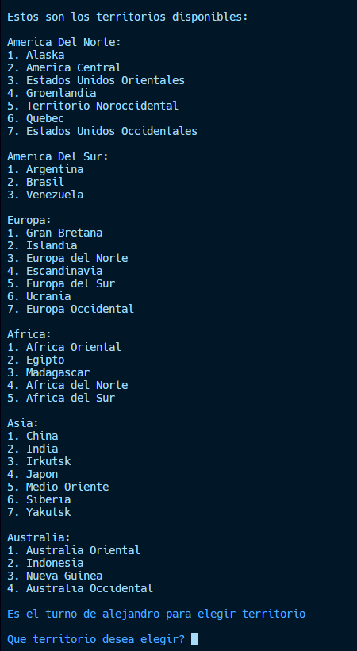

### 4. Asignar mas tropas por turnos 🪖
Entrada: nombre del territorio 

Resultado Esperado: muestra el nombre del territorio y la nueva cantidad de tropas.

Resultado Obtenido: ✅

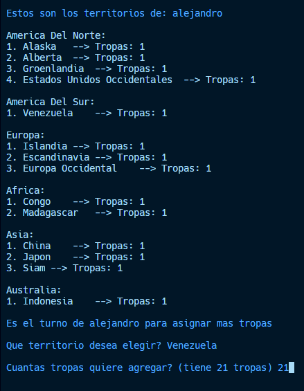

## Funcion turno 🎏

### 1. Ingresar nuevas tropas 🐧
Entrada: nombre del territorio 

Resultado Esperado: muestra el nombre del territorio y la nueva cantidad de tropas.

Resultado Obtenido: ✅

### 2. Atacar 🤺
Entrada: nombre del territorio de origen y nombre del territorio de destino

Resultado Esperado: se lanzan los dados y muestra si se logró o no el ataque, dando posibilidad a seguir o para el ataque.

Resultado Obtenido: ✅

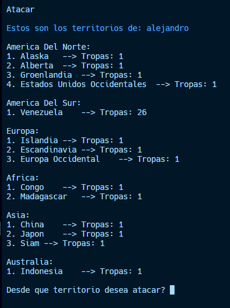

### 3. Fortificar 🛡️
Entrada: nombre del territorio de origen, nombre del territorio de destino y cantidad de tropas a enviar

Resultado Esperado: se muestra el territorio de origen y la cantidad de tropas restantes y el territorio de destino con la nueva cantidad de tropas.

Resultado Obtenido: ✅

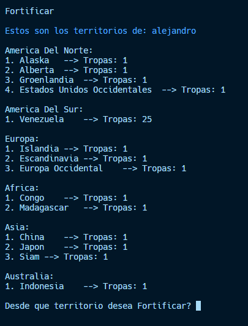

## Manejo de archivos 🗃️

### 1. Ingresar comando "guardar <nombre_archivo>" 📑
Entrada: guardar <nombre_archivo>

Resultado Esperado: no se ha podido guardar el archivo o si fue guardado exitosamente.

Resultado Obtenido: ✅, ✅

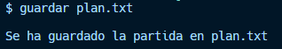

### 2. Ingresar comando "inicializar_texto <nombre_archivo>" 🚦
Entrada: inicializar_archivo <nombre_archivo> (este archivo es txt)

Resultado Esperado: No pudo leer el archivo, imprime el archivo que se ha leido y se puede jugar normalmente.

Resultado Obtenido: ✅, ✅

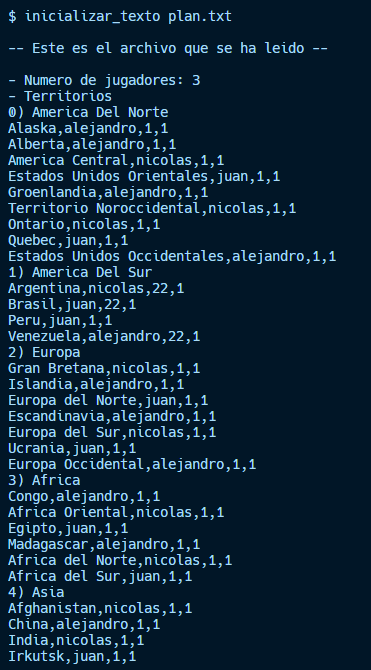

### 3. Ingresar comando "guardar_comprimido <nombre_archivo>" 💾
Entrada: guardar_comprimido <nombre_archivo>

Resultado Esperado: no se ha podido guardar el archivo o si fue guardado exitosamente.

Resultado Obtenido: ✅, ✅

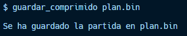

### 4. Ingresar comando "inicializar_binario <nombre_archivo>" 🚦
Entrada: inicializar_archivo <nombre_archivo>

Resultado Esperado: No pudo leer el archivo, imprime el archivo que se ha leido y se puede jugar normalmente.

Resultado Obtenido: ✅, ✅

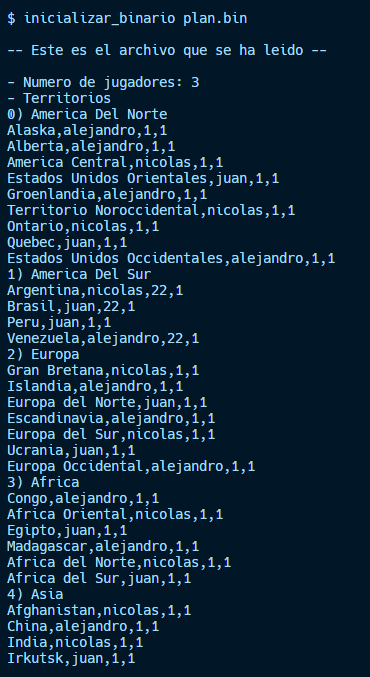
